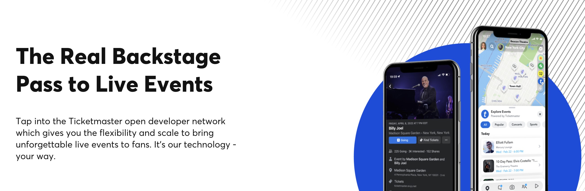

<div align="center">

[](https://developer.ticketmaster.com&#x2F;products-and-docs&#x2F;apis&#x2F;discovery-api&#x2F;v2&#x2F;)

# [Ticketmaster](https://developer.ticketmaster.com&#x2F;products-and-docs&#x2F;apis&#x2F;discovery-api&#x2F;v2&#x2F;)<a id="ticketmaster"></a>

The Ticketmaster Discovery API allows you to search for events, attractions, or venues.

</div>

## Table of Contents<a id="table-of-contents"></a>

<!-- toc -->

- [Installation](#installation)
- [Getting Started](#getting-started)
- [Reference](#reference)
  * [`ticketmaster.v2.eventSearch`](#ticketmasterv2eventsearch)
  * [`ticketmaster.v2.findSuggest`](#ticketmasterv2findsuggest)
  * [`ticketmaster.v2.findVenues`](#ticketmasterv2findvenues)
  * [`ticketmaster.v2.getAttractionDetails`](#ticketmasterv2getattractiondetails)
  * [`ticketmaster.v2.getClassificationDetails`](#ticketmasterv2getclassificationdetails)
  * [`ticketmaster.v2.getEventDetails`](#ticketmasterv2geteventdetails)
  * [`ticketmaster.v2.getEventImages`](#ticketmasterv2geteventimages)
  * [`ticketmaster.v2.getGenreDetails`](#ticketmasterv2getgenredetails)
  * [`ticketmaster.v2.getSegmentDetails`](#ticketmasterv2getsegmentdetails)
  * [`ticketmaster.v2.getSubgenreDetails`](#ticketmasterv2getsubgenredetails)
  * [`ticketmaster.v2.getVenueDetails`](#ticketmasterv2getvenuedetails)
  * [`ticketmaster.v2.searchAttractions`](#ticketmasterv2searchattractions)
  * [`ticketmaster.v2.searchClassifications`](#ticketmasterv2searchclassifications)

<!-- tocstop -->

## Installation<a id="installation"></a>
<div align="center">
  <a href="https://konfigthis.com/sdk-sign-up?company=Ticketmaster&serviceName=Discovery&language=TypeScript">
    
  </a>
</div>

## Getting Started<a id="getting-started"></a>

```typescript
import { Ticketmaster } from "ticketmaster-typescript-sdk";

const ticketmaster = new Ticketmaster({
  // Defining the base path is optional and defaults to http://www.ticketmaster.com/discovery/v2
  // basePath: "http://www.ticketmaster.com/discovery/v2",
  apiKey: "API_KEY",
});

const eventSearchResponse = await ticketmaster.v2.eventSearch({
  sort: "relevance,desc",
  startDateTime: "",
  endDateTime: "",
  onsaleStartDateTime: "",
  onsaleOnStartDate: "",
  onsaleOnAfterStartDate: "",
  onsaleEndDateTime: "",
  city: "",
  countryCode: "",
  stateCode: "",
  postalCode: "",
  venueId: "",
  attractionId: "",
  segmentId: "",
  segmentName: "",
  classificationName: [null],
  classificationId: [null],
  marketId: "",
  promoterId: "",
  dmaId: "",
  includeTBA: "no if date parameter sent, yes otherwise",
  includeTBD: "no if date parameter sent, yes otherwise",
  clientVisibility: "",
  latlong: "",
  radius: "50",
  unit: "miles",
  geoPoint: "",
  keyword: "",
  id: "",
  source: "",
  includeTest: "false",
  page: "0",
  size: "20",
  locale: "en",
  includeLicensedContent: "false",
  includeSpellcheck: "false",
});

console.log(eventSearchResponse);
```

## Reference<a id="reference"></a>


### `ticketmaster.v2.eventSearch`<a id="ticketmasterv2eventsearch"></a>

Find events and filter your search by location, date, availability, and much more.

#### 🛠️ Usage<a id="🛠️-usage"></a>

```typescript
const eventSearchResponse = await ticketmaster.v2.eventSearch({
  sort: "relevance,desc",
  startDateTime: "",
  endDateTime: "",
  onsaleStartDateTime: "",
  onsaleOnStartDate: "",
  onsaleOnAfterStartDate: "",
  onsaleEndDateTime: "",
  city: "",
  countryCode: "",
  stateCode: "",
  postalCode: "",
  venueId: "",
  attractionId: "",
  segmentId: "",
  segmentName: "",
  classificationName: [null],
  classificationId: [null],
  marketId: "",
  promoterId: "",
  dmaId: "",
  includeTBA: "no if date parameter sent, yes otherwise",
  includeTBD: "no if date parameter sent, yes otherwise",
  clientVisibility: "",
  latlong: "",
  radius: "50",
  unit: "miles",
  geoPoint: "",
  keyword: "",
  id: "",
  source: "",
  includeTest: "false",
  page: "0",
  size: "20",
  locale: "en",
  includeLicensedContent: "false",
  includeSpellcheck: "false",
});
```

#### ⚙️ Parameters<a id="⚙️-parameters"></a>

##### sort: `string`<a id="sort-string"></a>

Sorting order of the search result. Allowable values : \'name,asc\', \'name,desc\', \'date,asc\', \'date,desc\', \'relevance,asc\', \'relevance,desc\', \'distance,asc\', \'name,date,asc\', \'name,date,desc\', \'date,name,asc\', \'date,name,desc\',\'onsaleStartDate,asc\', \'id,asc\'

##### startDateTime: `string`<a id="startdatetime-string"></a>

Filter events with a start date after this date

##### endDateTime: `string`<a id="enddatetime-string"></a>

Filter events with a start date before this date

##### onsaleStartDateTime: `string`<a id="onsalestartdatetime-string"></a>

Filter events with onsale start date after this date

##### onsaleOnStartDate: `string`<a id="onsaleonstartdate-string"></a>

Filter events with onsale start date on this date

##### onsaleOnAfterStartDate: `string`<a id="onsaleonafterstartdate-string"></a>

Filter events with onsale range within this date

##### onsaleEndDateTime: `string`<a id="onsaleenddatetime-string"></a>

Filter events with onsale end date before this date

##### city: `string`<a id="city-string"></a>

Filter events by city

##### countryCode: `string`<a id="countrycode-string"></a>

Filter events by country code

##### stateCode: `string`<a id="statecode-string"></a>

Filter events by state code

##### postalCode: `string`<a id="postalcode-string"></a>

Filter events by postal code / zipcode

##### venueId: `string`<a id="venueid-string"></a>

Filter events by venue id

##### attractionId: `string`<a id="attractionid-string"></a>

Filter events by attraction id

##### segmentId: `string`<a id="segmentid-string"></a>

Filter events by segment id

##### segmentName: `string`<a id="segmentname-string"></a>

Filter events by segment name

##### classificationName: `any`<a id="classificationname-any"></a>
                          `any`[]

Filter events by classification name: name of any segment, genre, sub-genre, type, sub-type

##### classificationId: `any`<a id="classificationid-any"></a>
                        `any`[]

Filter events by classification id: id of any segment, genre, sub-genre, type, sub-type

##### marketId: `string`<a id="marketid-string"></a>

Filter events by market id

##### promoterId: `string`<a id="promoterid-string"></a>

Filter events by promoter id

##### dmaId: `string`<a id="dmaid-string"></a>

Filter events by dma id

##### includeTBA: `'true' | ' no' | ' only'`<a id="includetba-true---no---only"></a>

True, to include events with date to be announce (TBA)

##### includeTBD: `'true' | ' no' | ' only'`<a id="includetbd-true---no---only"></a>

True, to include event with a date to be defined (TBD)

##### clientVisibility: `string`<a id="clientvisibility-string"></a>

Filter events by clientName

##### latlong: `string`<a id="latlong-string"></a>

Filter events by latitude and longitude, this filter is deprecated and maybe removed in a future release, please use geoPoint instead

##### radius: `string`<a id="radius-string"></a>

Radius of the area in which we want to search for events.

##### unit: `'miles' | 'km'`<a id="unit-miles--km"></a>

Unit of the radius

##### geoPoint: `string`<a id="geopoint-string"></a>

filter events by geoHash

##### keyword: `string`<a id="keyword-string"></a>

Keyword to search on

##### id: `string`<a id="id-string"></a>

Filter entities by its id

##### source: `'ticketmaster' | ' universe' | ' frontgate' | ' tmr'`<a id="source-ticketmaster---universe---frontgate---tmr"></a>

Filter entities by its source name

##### includeTest: `'true' | ' no' | ' only'`<a id="includetest-true---no---only"></a>

True if you want to have entities flag as test in the response. Only, if you only wanted test entities

##### page: `string`<a id="page-string"></a>

Page number

##### size: `string`<a id="size-string"></a>

Page size of the response

##### locale: `string`<a id="locale-string"></a>

The locale in ISO code format. Multiple comma-separated values can be provided. When omitting the country part of the code (e.g. only \'en\' or \'fr\') then the first matching locale is used. When using a \'*\' it matches all locales. \'*\' can only be used at the end (e.g. \'en-us,en,*\') 

##### includeLicensedContent: `'true' | ' no'`<a id="includelicensedcontent-true---no"></a>

Yes if you want to display licensed content

##### includeSpellcheck: `'true' | ' no'`<a id="includespellcheck-true---no"></a>

yes, to include spell check suggestions in the response.

#### 🔄 Return<a id="🔄-return"></a>

[Event](./models/event.ts)

#### 🌐 Endpoint<a id="🌐-endpoint"></a>

`/discovery/v2/events` `GET`

[🔙 **Back to Table of Contents**](#table-of-contents)

---


### `ticketmaster.v2.findSuggest`<a id="ticketmasterv2findsuggest"></a>

Find search suggestions and filter your suggestions by location, source, etc.

#### 🛠️ Usage<a id="🛠️-usage"></a>

```typescript
const findSuggestResponse = await ticketmaster.v2.findSuggest({
  keyword: "",
  source: "",
  latlong: "",
  radius: "100",
  unit: "miles",
  size: "5",
  includeFuzzy: "false",
  clientVisibility: "",
  countryCode: "",
  includeTBA: "no if date parameter sent, yes otherwise",
  includeTBD: "no if date parameter sent, yes otherwise",
  segmentId: "",
  geoPoint: "",
  locale: "en",
  includeLicensedContent: "false",
  includeSpellcheck: "false",
});
```

#### ⚙️ Parameters<a id="⚙️-parameters"></a>

##### keyword: `string`<a id="keyword-string"></a>

Keyword to search on

##### source: `'ticketmaster' | ' universe' | ' frontgate' | ' tmr'`<a id="source-ticketmaster---universe---frontgate---tmr"></a>

Filter entities by its source name

##### latlong: `string`<a id="latlong-string"></a>

Filter events by latitude and longitude, this filter is deprecated and maybe removed in a future release, please use geoPoint instead

##### radius: `string`<a id="radius-string"></a>

Radius of the area in which we want to search for events.

##### unit: `'miles' | 'km'`<a id="unit-miles--km"></a>

Unit of the radius

##### size: `string`<a id="size-string"></a>

Size of every entity returned in the response

##### includeFuzzy: `'true' | ' no'`<a id="includefuzzy-true---no"></a>

yes, to include fuzzy matches in the search. This has performance impact.

##### clientVisibility: `string`<a id="clientvisibility-string"></a>

Filter events to clientName

##### countryCode: `string`<a id="countrycode-string"></a>

Filter suggestions by country code

##### includeTBA: `'true' | ' no' | ' only'`<a id="includetba-true---no---only"></a>

True, to include events with date to be announce (TBA)

##### includeTBD: `'true' | ' no' | ' only'`<a id="includetbd-true---no---only"></a>

True, to include event with a date to be defined (TBD)

##### segmentId: `string`<a id="segmentid-string"></a>

Filter suggestions by segment id

##### geoPoint: `string`<a id="geopoint-string"></a>

filter events by geoHash

##### locale: `string`<a id="locale-string"></a>

The locale in ISO code format. Multiple comma-separated values can be provided. When omitting the country part of the code (e.g. only \'en\' or \'fr\') then the first matching locale is used. When using a \'*\' it matches all locales. \'*\' can only be used at the end (e.g. \'en-us,en,*\') 

##### includeLicensedContent: `'true' | ' no'`<a id="includelicensedcontent-true---no"></a>

Yes if you want to display licensed content

##### includeSpellcheck: `'true' | ' no'`<a id="includespellcheck-true---no"></a>

yes, to include spell check suggestions in the response.

#### 🌐 Endpoint<a id="🌐-endpoint"></a>

`/discovery/v2/suggest` `GET`

[🔙 **Back to Table of Contents**](#table-of-contents)

---


### `ticketmaster.v2.findVenues`<a id="ticketmasterv2findvenues"></a>

Find venues and filter your search by name, and much more.

#### 🛠️ Usage<a id="🛠️-usage"></a>

```typescript
const findVenuesResponse = await ticketmaster.v2.findVenues({
  sort: "relevance,desc",
  stateCode: "",
  countryCode: "",
  latlong: "",
  radius: "50",
  unit: "miles",
  geoPoint: "",
  keyword: "",
  id: "",
  source: "",
  includeTest: "false",
  page: "0",
  size: "20",
  locale: "en",
  includeLicensedContent: "false",
  includeSpellcheck: "false",
});
```

#### ⚙️ Parameters<a id="⚙️-parameters"></a>

##### sort: `string`<a id="sort-string"></a>

Sorting order of the search result. Allowable Values: \'name,asc\', \'name,desc\', \'relevance,asc\', \'relevance,desc\', \'distance,asc\', \'distance,desc\'

##### stateCode: `string`<a id="statecode-string"></a>

Filter venues by state / province code

##### countryCode: `string`<a id="countrycode-string"></a>

Filter venues by country code

##### latlong: `string`<a id="latlong-string"></a>

Filter events by latitude and longitude, this filter is deprecated and maybe removed in a future release, please use geoPoint instead

##### radius: `string`<a id="radius-string"></a>

Radius of the area in which we want to search for events.

##### unit: `'miles' | 'km'`<a id="unit-miles--km"></a>

Unit of the radius

##### geoPoint: `string`<a id="geopoint-string"></a>

filter events by geoHash

##### keyword: `string`<a id="keyword-string"></a>

Keyword to search on

##### id: `string`<a id="id-string"></a>

Filter entities by its id

##### source: `'ticketmaster' | ' universe' | ' frontgate' | ' tmr'`<a id="source-ticketmaster---universe---frontgate---tmr"></a>

Filter entities by its source name

##### includeTest: `'true' | ' no' | ' only'`<a id="includetest-true---no---only"></a>

True if you want to have entities flag as test in the response. Only, if you only wanted test entities

##### page: `string`<a id="page-string"></a>

Page number

##### size: `string`<a id="size-string"></a>

Page size of the response

##### locale: `string`<a id="locale-string"></a>

The locale in ISO code format. Multiple comma-separated values can be provided. When omitting the country part of the code (e.g. only \'en\' or \'fr\') then the first matching locale is used. When using a \'*\' it matches all locales. \'*\' can only be used at the end (e.g. \'en-us,en,*\') 

##### includeLicensedContent: `'true' | ' no'`<a id="includelicensedcontent-true---no"></a>

Yes if you want to display licensed content

##### includeSpellcheck: `'true' | ' no'`<a id="includespellcheck-true---no"></a>

yes, to include spell check suggestions in the response.

#### 🔄 Return<a id="🔄-return"></a>

[Venue](./models/venue.ts)

#### 🌐 Endpoint<a id="🌐-endpoint"></a>

`/discovery/v2/venues` `GET`

[🔙 **Back to Table of Contents**](#table-of-contents)

---


### `ticketmaster.v2.getAttractionDetails`<a id="ticketmasterv2getattractiondetails"></a>

Get details for a specific attraction using the unique identifier for the attraction.

#### 🛠️ Usage<a id="🛠️-usage"></a>

```typescript
const getAttractionDetailsResponse = await ticketmaster.v2.getAttractionDetails(
  {
    id: "id_example",
    locale: "en",
    includeLicensedContent: "false",
  }
);
```

#### ⚙️ Parameters<a id="⚙️-parameters"></a>

##### id: `string`<a id="id-string"></a>

ID of the attraction

##### locale: `string`<a id="locale-string"></a>

The locale in ISO code format. Multiple comma-separated values can be provided. When omitting the country part of the code (e.g. only \'en\' or \'fr\') then the first matching locale is used. When using a \'*\' it matches all locales. \'*\' can only be used at the end (e.g. \'en-us,en,*\') 

##### includeLicensedContent: `'true' | ' no'`<a id="includelicensedcontent-true---no"></a>

True if you want to display licensed content

#### 🔄 Return<a id="🔄-return"></a>

[Attraction](./models/attraction.ts)

#### 🌐 Endpoint<a id="🌐-endpoint"></a>

`/discovery/v2/attractions/{id}` `GET`

[🔙 **Back to Table of Contents**](#table-of-contents)

---


### `ticketmaster.v2.getClassificationDetails`<a id="ticketmasterv2getclassificationdetails"></a>

Get details for a specific segment, genre, or sub-genre using its unique identifier.

#### 🛠️ Usage<a id="🛠️-usage"></a>

```typescript
const getClassificationDetailsResponse =
  await ticketmaster.v2.getClassificationDetails({
    id: "id_example",
    locale: "en",
    includeLicensedContent: "false",
  });
```

#### ⚙️ Parameters<a id="⚙️-parameters"></a>

##### id: `string`<a id="id-string"></a>

ID of the segment, genre, or sub-genre

##### locale: `string`<a id="locale-string"></a>

The locale in ISO code format. Multiple comma-separated values can be provided. When omitting the country part of the code (e.g. only \'en\' or \'fr\') then the first matching locale is used. When using a \'*\' it matches all locales. \'*\' can only be used at the end (e.g. \'en-us,en,*\') 

##### includeLicensedContent: `'true' | ' no'`<a id="includelicensedcontent-true---no"></a>

True if you want to display licensed content

#### 🔄 Return<a id="🔄-return"></a>

[Classification](./models/classification.ts)

#### 🌐 Endpoint<a id="🌐-endpoint"></a>

`/discovery/v2/classifications/{id}` `GET`

[🔙 **Back to Table of Contents**](#table-of-contents)

---


### `ticketmaster.v2.getEventDetails`<a id="ticketmasterv2geteventdetails"></a>

Get details for a specific event using the unique identifier for the event. This includes the venue and location, the attraction(s), and the Ticketmaster Website URL for purchasing tickets for the event.

#### 🛠️ Usage<a id="🛠️-usage"></a>

```typescript
const getEventDetailsResponse = await ticketmaster.v2.getEventDetails({
  id: "id_example",
  locale: "en",
  includeLicensedContent: "false",
});
```

#### ⚙️ Parameters<a id="⚙️-parameters"></a>

##### id: `string`<a id="id-string"></a>

ID of the event

##### locale: `string`<a id="locale-string"></a>

The locale in ISO code format. Multiple comma-separated values can be provided. When omitting the country part of the code (e.g. only \'en\' or \'fr\') then the first matching locale is used. When using a \'*\' it matches all locales. \'*\' can only be used at the end (e.g. \'en-us,en,*\') 

##### includeLicensedContent: `'true' | ' no'`<a id="includelicensedcontent-true---no"></a>

True if you want to display licensed content

#### 🔄 Return<a id="🔄-return"></a>

[Event](./models/event.ts)

#### 🌐 Endpoint<a id="🌐-endpoint"></a>

`/discovery/v2/events/{id}` `GET`

[🔙 **Back to Table of Contents**](#table-of-contents)

---


### `ticketmaster.v2.getEventImages`<a id="ticketmasterv2geteventimages"></a>

Get images for a specific event using the unique identifier for the event.

#### 🛠️ Usage<a id="🛠️-usage"></a>

```typescript
const getEventImagesResponse = await ticketmaster.v2.getEventImages({
  id: "id_example",
  locale: "en",
  includeLicensedContent: "false",
});
```

#### ⚙️ Parameters<a id="⚙️-parameters"></a>

##### id: `string`<a id="id-string"></a>

ID of the event

##### locale: `string`<a id="locale-string"></a>

The locale in ISO code format. Multiple comma-separated values can be provided. When omitting the country part of the code (e.g. only \'en\' or \'fr\') then the first matching locale is used. When using a \'*\' it matches all locales. \'*\' can only be used at the end (e.g. \'en-us,en,*\') 

##### includeLicensedContent: `'true' | ' no'`<a id="includelicensedcontent-true---no"></a>

True if you want to display licensed content

#### 🔄 Return<a id="🔄-return"></a>

[EventImages](./models/event-images.ts)

#### 🌐 Endpoint<a id="🌐-endpoint"></a>

`/discovery/v2/events/{id}/images` `GET`

[🔙 **Back to Table of Contents**](#table-of-contents)

---


### `ticketmaster.v2.getGenreDetails`<a id="ticketmasterv2getgenredetails"></a>

Get details for a specific genre using its unique identifier.

#### 🛠️ Usage<a id="🛠️-usage"></a>

```typescript
const getGenreDetailsResponse = await ticketmaster.v2.getGenreDetails({
  id: "id_example",
  locale: "en",
  includeLicensedContent: "false",
});
```

#### ⚙️ Parameters<a id="⚙️-parameters"></a>

##### id: `string`<a id="id-string"></a>

ID of the genre

##### locale: `string`<a id="locale-string"></a>

The locale in ISO code format. Multiple comma-separated values can be provided. When omitting the country part of the code (e.g. only \'en\' or \'fr\') then the first matching locale is used. When using a \'*\' it matches all locales. \'*\' can only be used at the end (e.g. \'en-us,en,*\') 

##### includeLicensedContent: `'true' | ' no'`<a id="includelicensedcontent-true---no"></a>

True if you want to display licensed content

#### 🔄 Return<a id="🔄-return"></a>

[Genre](./models/genre.ts)

#### 🌐 Endpoint<a id="🌐-endpoint"></a>

`/discovery/v2/classifications/genres/{id}` `GET`

[🔙 **Back to Table of Contents**](#table-of-contents)

---


### `ticketmaster.v2.getSegmentDetails`<a id="ticketmasterv2getsegmentdetails"></a>

Get details for a specific segment using its unique identifier.

#### 🛠️ Usage<a id="🛠️-usage"></a>

```typescript
const getSegmentDetailsResponse = await ticketmaster.v2.getSegmentDetails({
  id: "id_example",
  locale: "en",
  includeLicensedContent: "false",
});
```

#### ⚙️ Parameters<a id="⚙️-parameters"></a>

##### id: `string`<a id="id-string"></a>

ID of the segment

##### locale: `string`<a id="locale-string"></a>

The locale in ISO code format. Multiple comma-separated values can be provided. When omitting the country part of the code (e.g. only \'en\' or \'fr\') then the first matching locale is used. When using a \'*\' it matches all locales. \'*\' can only be used at the end (e.g. \'en-us,en,*\') 

##### includeLicensedContent: `'true' | ' no'`<a id="includelicensedcontent-true---no"></a>

True if you want to display licensed content

#### 🔄 Return<a id="🔄-return"></a>

[Segment](./models/segment.ts)

#### 🌐 Endpoint<a id="🌐-endpoint"></a>

`/discovery/v2/classifications/segments/{id}` `GET`

[🔙 **Back to Table of Contents**](#table-of-contents)

---


### `ticketmaster.v2.getSubgenreDetails`<a id="ticketmasterv2getsubgenredetails"></a>

Get details for a specific sub-genre using its unique identifier.

#### 🛠️ Usage<a id="🛠️-usage"></a>

```typescript
const getSubgenreDetailsResponse = await ticketmaster.v2.getSubgenreDetails({
  id: "id_example",
  locale: "en",
  includeLicensedContent: "false",
});
```

#### ⚙️ Parameters<a id="⚙️-parameters"></a>

##### id: `string`<a id="id-string"></a>

ID of the subgenre

##### locale: `string`<a id="locale-string"></a>

The locale in ISO code format. Multiple comma-separated values can be provided. When omitting the country part of the code (e.g. only \'en\' or \'fr\') then the first matching locale is used. When using a \'*\' it matches all locales. \'*\' can only be used at the end (e.g. \'en-us,en,*\') 

##### includeLicensedContent: `'true' | ' no'`<a id="includelicensedcontent-true---no"></a>

True if you want to display licensed content

#### 🔄 Return<a id="🔄-return"></a>

[Level](./models/level.ts)

#### 🌐 Endpoint<a id="🌐-endpoint"></a>

`/discovery/v2/classifications/subgenres/{id}` `GET`

[🔙 **Back to Table of Contents**](#table-of-contents)

---


### `ticketmaster.v2.getVenueDetails`<a id="ticketmasterv2getvenuedetails"></a>

Get details for a specific venue using the unique identifier for the venue.

#### 🛠️ Usage<a id="🛠️-usage"></a>

```typescript
const getVenueDetailsResponse = await ticketmaster.v2.getVenueDetails({
  id: "id_example",
  locale: "en",
  includeLicensedContent: "false",
});
```

#### ⚙️ Parameters<a id="⚙️-parameters"></a>

##### id: `string`<a id="id-string"></a>

ID of the venue

##### locale: `string`<a id="locale-string"></a>

The locale in ISO code format. Multiple comma-separated values can be provided. When omitting the country part of the code (e.g. only \'en\' or \'fr\') then the first matching locale is used. When using a \'*\' it matches all locales. \'*\' can only be used at the end (e.g. \'en-us,en,*\') 

##### includeLicensedContent: `'true' | ' no'`<a id="includelicensedcontent-true---no"></a>

True if you want to display licensed content

#### 🔄 Return<a id="🔄-return"></a>

[Venue](./models/venue.ts)

#### 🌐 Endpoint<a id="🌐-endpoint"></a>

`/discovery/v2/venues/{id}` `GET`

[🔙 **Back to Table of Contents**](#table-of-contents)

---


### `ticketmaster.v2.searchAttractions`<a id="ticketmasterv2searchattractions"></a>

Find attractions (artists, sports, packages, plays and so on) and filter your search by name, and much more.

#### 🛠️ Usage<a id="🛠️-usage"></a>

```typescript
const searchAttractionsResponse = await ticketmaster.v2.searchAttractions({
  sort: "relevance,desc",
  classificationName: [null],
  classificationId: [null],
  keyword: "",
  id: "",
  source: "",
  includeTest: "false",
  page: "0",
  size: "20",
  locale: "en",
  includeLicensedContent: "false",
  includeSpellcheck: "false",
});
```

#### ⚙️ Parameters<a id="⚙️-parameters"></a>

##### sort: `string`<a id="sort-string"></a>

Sorting order of the search result. Allowable Values : \'name,asc\', \'name,desc\', \'relevance,asc\', \'relevance,desc\'

##### classificationName: `any`<a id="classificationname-any"></a>
                          `any`[]

Filter attractions by classification name: name of any segment, genre, sub-genre, type, sub-type

##### classificationId: `any`<a id="classificationid-any"></a>
                        `any`[]

Filter attractions by classification id: id of any segment, genre, sub-genre, type, sub-type

##### keyword: `string`<a id="keyword-string"></a>

Keyword to search on

##### id: `string`<a id="id-string"></a>

Filter entities by its id

##### source: `'ticketmaster' | ' universe' | ' frontgate' | ' tmr'`<a id="source-ticketmaster---universe---frontgate---tmr"></a>

Filter entities by its source name

##### includeTest: `'true' | ' no' | ' only'`<a id="includetest-true---no---only"></a>

True if you want to have entities flag as test in the response. Only, if you only wanted test entities

##### page: `string`<a id="page-string"></a>

Page number

##### size: `string`<a id="size-string"></a>

Page size of the response

##### locale: `string`<a id="locale-string"></a>

The locale in ISO code format. Multiple comma-separated values can be provided. When omitting the country part of the code (e.g. only \'en\' or \'fr\') then the first matching locale is used. When using a \'*\' it matches all locales. \'*\' can only be used at the end (e.g. \'en-us,en,*\') 

##### includeLicensedContent: `'true' | ' no'`<a id="includelicensedcontent-true---no"></a>

Yes if you want to display licensed content

##### includeSpellcheck: `'true' | ' no'`<a id="includespellcheck-true---no"></a>

yes, to include spell check suggestions in the response.

#### 🔄 Return<a id="🔄-return"></a>

[Attraction](./models/attraction.ts)

#### 🌐 Endpoint<a id="🌐-endpoint"></a>

`/discovery/v2/attractions` `GET`

[🔙 **Back to Table of Contents**](#table-of-contents)

---


### `ticketmaster.v2.searchClassifications`<a id="ticketmasterv2searchclassifications"></a>

Find classifications and filter your search by name, and much more. Classifications help define the nature of attractions and events.

#### 🛠️ Usage<a id="🛠️-usage"></a>

```typescript
const searchClassificationsResponse =
  await ticketmaster.v2.searchClassifications({
    sort: "name,asc",
    keyword: "",
    id: "",
    source: "",
    includeTest: "false",
    page: "0",
    size: "20",
    locale: "en",
    includeLicensedContent: "false",
    includeSpellcheck: "false",
  });
```

#### ⚙️ Parameters<a id="⚙️-parameters"></a>

##### sort: `string`<a id="sort-string"></a>

Sorting order of the search result

##### keyword: `string`<a id="keyword-string"></a>

Keyword to search on

##### id: `string`<a id="id-string"></a>

Filter entities by its id

##### source: `'ticketmaster' | ' universe' | ' frontgate' | ' tmr'`<a id="source-ticketmaster---universe---frontgate---tmr"></a>

Filter entities by its source name

##### includeTest: `'true' | ' no' | ' only'`<a id="includetest-true---no---only"></a>

True if you want to have entities flag as test in the response. Only, if you only wanted test entities

##### page: `string`<a id="page-string"></a>

Page number

##### size: `string`<a id="size-string"></a>

Page size of the response

##### locale: `string`<a id="locale-string"></a>

The locale in ISO code format. Multiple comma-separated values can be provided. When omitting the country part of the code (e.g. only \'en\' or \'fr\') then the first matching locale is used. When using a \'*\' it matches all locales. \'*\' can only be used at the end (e.g. \'en-us,en,*\') 

##### includeLicensedContent: `'true' | ' no'`<a id="includelicensedcontent-true---no"></a>

Yes if you want to display licensed content

##### includeSpellcheck: `'true' | ' no'`<a id="includespellcheck-true---no"></a>

yes, to include spell check suggestions in the response.

#### 🔄 Return<a id="🔄-return"></a>

[Classification](./models/classification.ts)

#### 🌐 Endpoint<a id="🌐-endpoint"></a>

`/discovery/v2/classifications` `GET`

[🔙 **Back to Table of Contents**](#table-of-contents)

---


## Author<a id="author"></a>
This TypeScript package is automatically generated by [Konfig](https://konfigthis.com)
